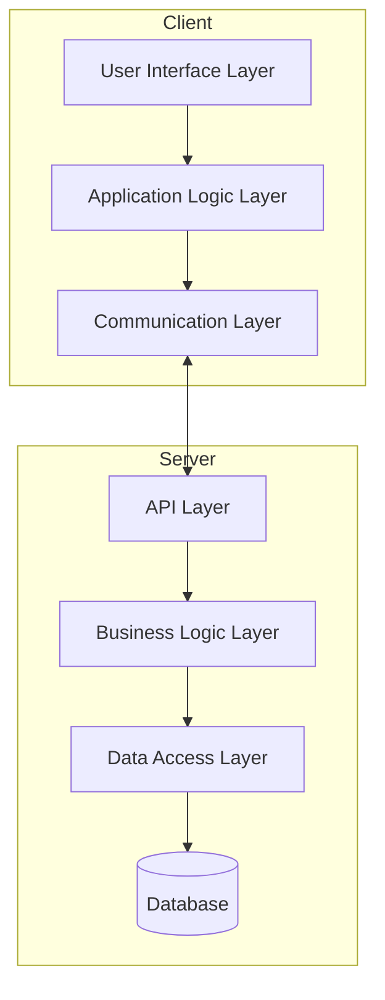
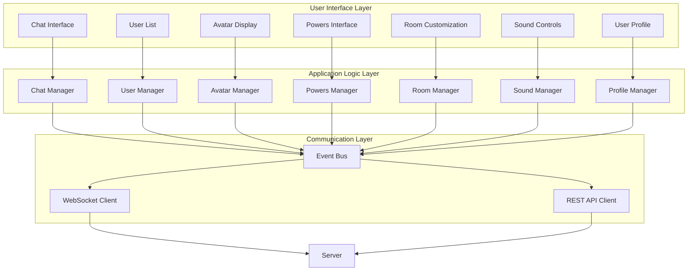
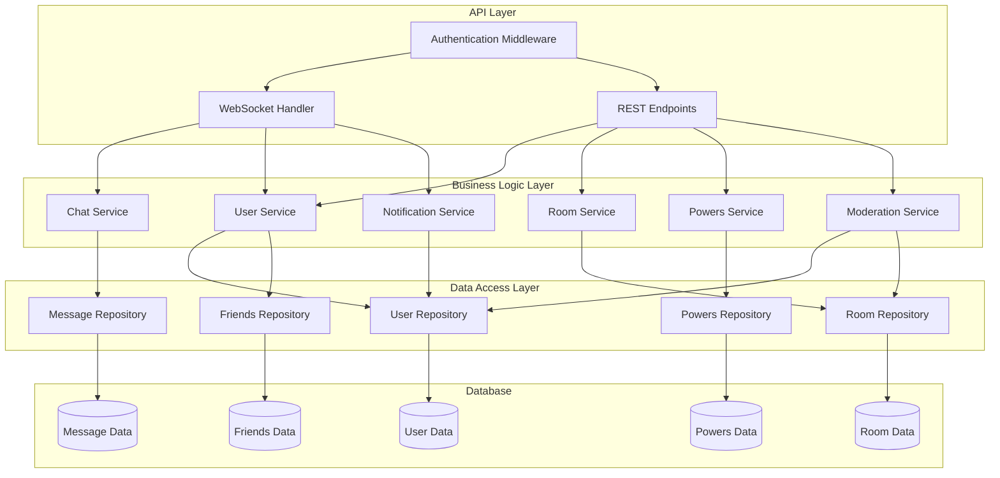
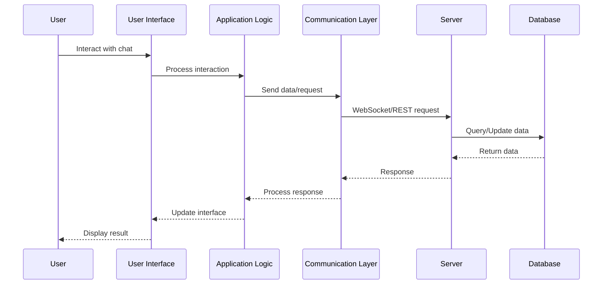
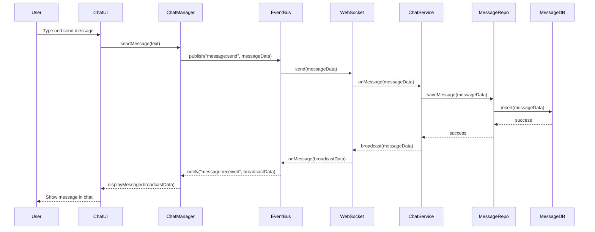
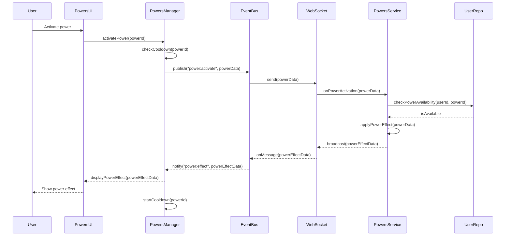
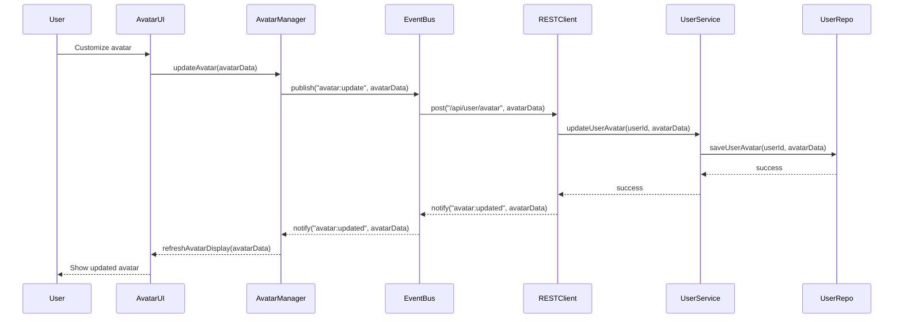
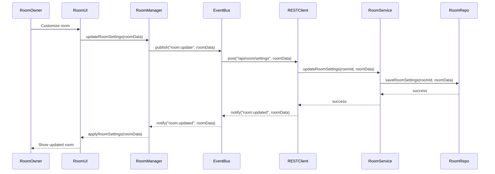

# Unified Architecture Diagram for Xat Recreation

## System Architecture Overview



## Client-Side Architecture



## Server-Side Architecture



## Component Interactions



## Data Flow for Message Sending



## Power Activation Flow



## Avatar Customization Flow



## Room Customization Flow



## API Endpoints

### REST API Endpoints

| Endpoint | Method | Description |
|----------|--------|-------------|
| `/api/auth/login` | POST | User login |
| `/api/auth/register` | POST | User registration |
| `/api/auth/logout` | POST | User logout |
| `/api/user/profile` | GET | Get user profile |
| `/api/user/profile` | PUT | Update user profile |
| `/api/user/avatar` | PUT | Update user avatar |
| `/api/user/friends` | GET | Get user's friends list |
| `/api/user/friends/:id` | POST | Add friend |
| `/api/user/friends/:id` | DELETE | Remove friend |
| `/api/room` | GET | Get list of rooms |
| `/api/room` | POST | Create new room |
| `/api/room/:id` | GET | Get room details |
| `/api/room/:id` | PUT | Update room settings |
| `/api/room/:id/users` | GET | Get users in room |
| `/api/powers` | GET | Get available powers |
| `/api/powers/:id` | GET | Get power details |
| `/api/powers/user` | GET | Get user's powers |

### WebSocket Events

| Event | Direction | Description |
|-------|-----------|-------------|
| `user:join` | Server → Client | User joined room |
| `user:leave` | Server → Client | User left room |
| `user:status` | Server → Client | User status changed |
| `message:send` | Client → Server | Send message |
| `message:received` | Server → Client | New message received |
| `power:activate` | Client → Server | Activate power |
| `power:effect` | Server → Client | Power effect applied |
| `room:update` | Server → Client | Room settings updated |
| `typing:start` | Client → Server | User started typing |
| `typing:stop` | Client → Server | User stopped typing |

## Database Schema

### User Collection
```json
{
  "id": "string",
  "username": "string",
  "email": "string",
  "passwordHash": "string",
  "displayName": "string",
  "avatar": {
    "type": "string",
    "customizations": "object"
  },
  "powers": [
    {
      "id": "string",
      "cooldownEnds": "timestamp"
    }
  ],
  "friends": ["userId"],
  "blocked": ["userId"],
  "status": "string",
  "lastSeen": "timestamp",
  "settings": {
    "sound": "boolean",
    "notifications": "boolean",
    "privacy": "object"
  }
}
```

### Room Collection
```json
{
  "id": "string",
  "name": "string",
  "description": "string",
  "owner": "userId",
  "moderators": ["userId"],
  "background": {
    "type": "string",
    "url": "string"
  },
  "theme": {
    "colors": {
      "primary": "string",
      "secondary": "string",
      "text": "string"
    },
    "font": "string"
  },
  "settings": {
    "isPrivate": "boolean",
    "allowGuests": "boolean",
    "messageRateLimit": "number",
    "backgroundMusic": {
      "enabled": "boolean",
      "url": "string"
    }
  },
  "bannedUsers": ["userId"],
  "mutedUsers": [
    {
      "userId": "string",
      "until": "timestamp"
    }
  ]
}
```

### Message Collection
```json
{
  "id": "string",
  "roomId": "string",
  "userId": "string",
  "content": "string",
  "type": "string",
  "timestamp": "timestamp",
  "mentions": ["userId"],
  "powerEffect": {
    "powerId": "string",
    "effect": "string"
  }
}
```

### Power Collection
```json
{
  "id": "string",
  "name": "string",
  "description": "string",
  "type": "string",
  "rarity": "string",
  "effects": {
    "visual": "string",
    "sound": "string",
    "interaction": "string"
  },
  "cooldown": "number",
  "icon": "string"
}
```

## Technology Stack

### Frontend
- HTML5, CSS3, JavaScript
- WebSocket API for real-time communication
- Canvas/WebGL for advanced visual effects
- Howler.js for sound management

### Backend
- Node.js with Express
- Socket.io for WebSocket communication
- Authentication middleware
- MongoDB for data storage
- Redis for caching and session management

### Development Tools
- Git for version control
- Webpack for bundling
- ESLint for code quality
- Jest for testing
- Docker for containerization

This architecture provides a comprehensive blueprint for implementing the xat recreation project, with clear separation of concerns and well-defined component interactions.