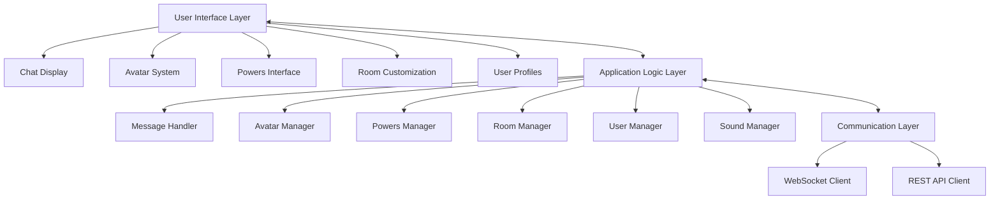
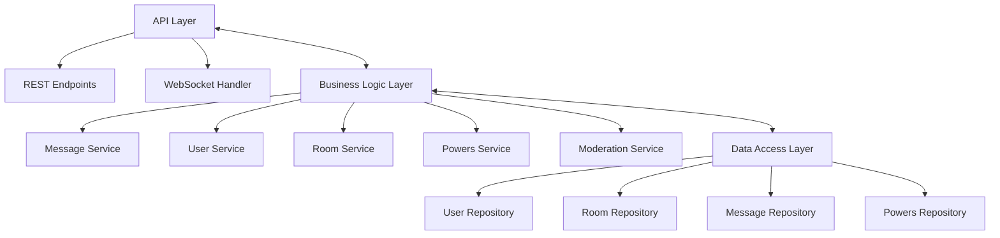

# Design Document: Xat Recreation

## Overview

This design document outlines the architecture and components for recreating the xat.com chat platform experience. The system will be built using modern web technologies while maintaining the nostalgic look and feel of the original xat platform. The design focuses on creating a real-time chat system with support for avatars (pawns), powers, room customization, and other key features that made xat unique.

## Architecture

The application will follow a client-server architecture with the following key components:

### Client-Side Architecture



### Server-Side Architecture



## Components and Interfaces

### 1. User Interface Components

#### 1.1 Chat Interface
- Main chat window displaying messages with user avatars
- User list sidebar showing online users
- Input area with formatting options
- Room information and settings panel
- Responsive design for different screen sizes

#### 1.2 Avatar System Interface
- Avatar selection and customization panel
- Preview functionality
- Avatar positioning in chat
- Animation controls

#### 1.3 Powers Interface
- Powers inventory display
- Power activation controls
- Visual effects rendering
- Cooldown indicators

#### 1.4 Room Customization Interface
- Background selection and upload
- Color scheme customization
- Font and text styling options
- Sound settings
- Moderation settings

#### 1.5 User Profile Interface
- Profile information display and editing
- Friends list management
- Privacy settings
- Powers and avatar showcase

### 2. Application Logic Components

#### 2.1 Message Handler
- Message formatting and rendering
- Message history management
- Special message types (system messages, power notifications)
- Message filtering and moderation

#### 2.2 Avatar Manager
- Avatar loading and rendering
- Animation handling
- Position calculation
- Customization application

#### 2.3 Powers Manager
- Power activation logic
- Effect application
- Cooldown tracking
- Permission verification

#### 2.4 Room Manager
- Room settings application
- Background and theme management
- User permissions within rooms
- Room creation and joining logic

#### 2.5 User Manager
- Authentication and session management
- User status tracking
- Friend relationship handling
- Profile data management

#### 2.6 Sound Manager
- Sound effect triggering
- Background music handling
- Volume control
- Mute functionality

### 3. Communication Components

#### 3.1 WebSocket Client/Server
- Real-time message delivery
- Presence updates (join/leave notifications)
- Typing indicators
- Power activation broadcasts

#### 3.2 REST API
- User authentication
- Profile management
- Room configuration
- Historical data retrieval

## Data Models

### User Model
```json
{
  "id": "string",
  "username": "string",
  "displayName": "string",
  "email": "string",
  "passwordHash": "string",
  "avatar": {
    "type": "string",
    "customizations": "object"
  },
  "powers": [
    {
      "id": "string",
      "name": "string",
      "description": "string",
      "cooldown": "number",
      "lastUsed": "timestamp"
    }
  ],
  "friends": ["userId"],
  "blocked": ["userId"],
  "status": "string",
  "lastSeen": "timestamp",
  "joinDate": "timestamp",
  "settings": {
    "soundEnabled": "boolean",
    "notificationsEnabled": "boolean",
    "privacyLevel": "string"
  }
}
```

### Room Model
```json
{
  "id": "string",
  "name": "string",
  "description": "string",
  "owner": "userId",
  "moderators": ["userId"],
  "background": {
    "type": "string",
    "url": "string"
  },
  "theme": {
    "colors": {
      "primary": "string",
      "secondary": "string",
      "text": "string"
    },
    "font": "string"
  },
  "settings": {
    "isPrivate": "boolean",
    "allowGuests": "boolean",
    "messageRateLimit": "number",
    "backgroundMusic": {
      "enabled": "boolean",
      "url": "string",
      "volume": "number"
    }
  },
  "bannedUsers": ["userId"],
  "mutedUsers": [
    {
      "userId": "string",
      "until": "timestamp"
    }
  ],
  "createdAt": "timestamp"
}
```

### Message Model
```json
{
  "id": "string",
  "roomId": "string",
  "userId": "string",
  "content": "string",
  "type": "string",
  "timestamp": "timestamp",
  "mentions": ["userId"],
  "powerUsed": {
    "powerId": "string",
    "effect": "string"
  },
  "isEdited": "boolean",
  "isDeleted": "boolean"
}
```

### Power Model
```json
{
  "id": "string",
  "name": "string",
  "description": "string",
  "type": "string",
  "rarity": "string",
  "effects": {
    "visual": "string",
    "sound": "string",
    "interaction": "string"
  },
  "cooldown": "number",
  "icon": "string"
}
```

## Error Handling

### Client-Side Error Handling
- Connection loss detection and reconnection strategy
- Form validation with user feedback
- Graceful degradation for unsupported features
- Error messages with user-friendly descriptions
- Logging system for debugging

### Server-Side Error Handling
- Input validation and sanitization
- Rate limiting to prevent abuse
- Authentication and authorization checks
- Database transaction management
- Comprehensive error logging
- HTTP status codes for REST API errors
- WebSocket error events

## Testing Strategy

### Unit Testing
- Component-level tests for UI elements
- Service-level tests for business logic
- Repository-level tests for data access
- Mocking of external dependencies

### Integration Testing
- API endpoint testing
- WebSocket communication testing
- Database interaction testing
- Service interaction testing

### End-to-End Testing
- User flow testing (registration, login, chat)
- Room creation and customization
- Power activation and effects
- Avatar selection and customization
- Moderation tools functionality

### Performance Testing
- Message throughput testing
- Concurrent user load testing
- Database query performance
- Asset loading performance

## Security Considerations

- Secure authentication with JWT or session tokens
- HTTPS for all communications
- WebSocket connection authentication
- Input sanitization to prevent XSS
- Rate limiting to prevent abuse
- Content moderation for user-generated content
- Secure storage of user credentials (hashed passwords)
- Permission-based access control

## Implementation Technologies

### Frontend
- HTML5, CSS3, JavaScript
- WebSocket API for real-time communication
- Canvas/WebGL for advanced visual effects
- Howler.js for sound management (already in the project)
- Modern CSS for styling and animations

### Backend
- Node.js with Express (server.js already exists in the project)
- Socket.io or native WebSockets for real-time communication
- Authentication middleware
- Database ORM/ODM for data access
- Content moderation services

### Data Storage
- MongoDB or PostgreSQL for user and room data
- Redis for caching and session management
- File storage for user uploads (avatars, backgrounds)

## Integration with Existing Codebase

Based on the file structure in the workspace, the implementation will leverage and extend the existing codebase:

- Utilize existing CSS files in the `/css` directory for styling
- Extend JavaScript files in the `/js` directory, particularly:
  - `xat.js` and `xat2.js` for core functionality
  - `Avatars.js` for the avatar system
  - `messages.js` for message handling
  - `settings.js` for user and room settings
  - `howler.min.js` for sound management
- Leverage existing SVG assets in the `/svg` directory for UI elements
- Use sound files in the `/sounds` directory and extend as needed
- Integrate with existing HTML templates like `chat.html` and `classic.html`

## Deployment Considerations

- Responsive design for mobile and desktop compatibility
- Asset optimization for faster loading
- CDN integration for static assets
- Scalable WebSocket server architecture
- Database indexing for performance
- Caching strategy for frequently accessed data
- Monitoring and analytics integration